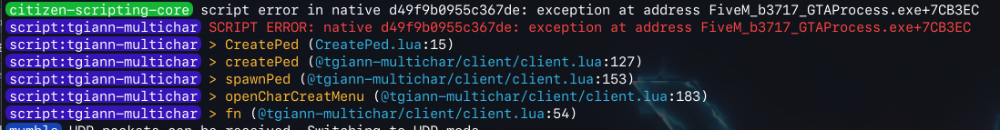

# tgiann-bypass-ymt-limit

This is a **temporary workaround** for the YMT limit in FiveM. Using this script may cause **unpredictable crashes or instability**, but it will bypass the YMT limits when active.

This method was discovered by chance while trying to fix an issue in the [tgiann-multichar](https://www.tgiann.com/package/tgiann-multichar-spawn-selector-script) script. My friend **[um](https://shop.uyuyorumstore.com/)** noticed the exploit and helped find the exact code — we discovered this workaround together.

## Warning

**Use at your own risk.** There is no guarantee that this will not cause unknown problems in the future. This is not a permanent fix — it is a temporary bypass. For a proper solution, refer to the links below.

## YMT Limit Details

If your clothing pack exceeds the YMT limit, you will encounter `SetPlayerModel` crashes or persistent errors/warnings with normal peds. The following crashes are associated with this issue:

- **Crash 3407:** `fillet-may-north`
- **Crash 3570:** `pennsylvania-oranges-vermont`

## Test Results

A clothing pack was installed and tested across multiple gamebuild versions with the bypass code enabled and disabled. The clothing pack is assumed to contain **5 YMTs**, because when the YMT limit drops to 4, the `CreatePed` native throws the error shown below.

### Test Environment

| Gamebuild | YMT Limit | Bypass Code | pcall (CreatePed) | Clothing Pack      | Result                                   |
| --------- | --------- | ----------- | ----------------- | ------------------ | ---------------------------------------- |
| 3258      | 8         | OFF         | Active            | All enabled        | No crash, working                        |
| 3407      | 6         | OFF         | Active            | All enabled        | No crash, working                        |
| 3570      | 5         | OFF         | Active            | All enabled        | No crash, working                        |
| 3717      | 4         | OFF         | Active            | All enabled        | No crash, F8 for pcall createPed Native  |
| 3717      | 4         | OFF         | Disabled          | All enabled        | Native crash — stuck on loading screen   |
| 3717      | 4         | OFF         | Disabled          | 1 YMT pack stopped | Native crash — stuck on loading screen   |
| 3717      | 4         | OFF         | Disabled          | 2 YMT pack stopped | Everything works perfectly               |
| 3717      | 4         | **ON**      | Disabled          | All enabled        | **No crash, everything works perfectly** |
| 3717      | 4         | OFF         | Disabled          | All enabled        | **Native crash** (see below)             |

### Native Crash

When the YMT limit is exceeded and the bypass code is **not active**, the `CreatePed` native crashes with the following error:

### Conclusion

- Gamebuild versions with a YMT limit **higher than or equal to** the clothing pack's YMT count work without any issues, regardless of the bypass code.
- At gamebuild **3717** (YMT limit: 4), the clothing pack's 5 YMTs exceed the limit. Without the bypass, `CreatePed` causes a native crash.
- With the bypass code **active** (SessionStarted `requestModel`), all clothing packs load and work perfectly even when the YMT limit is exceeded.

> **Important:** This bypass does **not** remove the YMT limit entirely. Based on our tests, it only increases the limit by **1 or 2 per gender**. It is not an unlimited bypass.

## The Real Solution

When you exceed the YMT limit, you will encounter some of the crashes listed above. There are two proper ways to resolve this:

1. **Switch to a higher gamebuild version** that supports a higher YMT limit.
2. **Reduce your YMT count** by removing or consolidating clothing packs.

For more detailed information, refer to the following documentation:

- [YMT Limit in Detail](https://docs.gta.clothing/game-mechanics/game-limits-and-crashes#ymt-limit-in-detail)
- [Effects of Reaching the YMT Limit](https://docs.gta.clothing/game-mechanics/game-limits-and-crashes#effects-of-reaching-the-ymt-limit)
